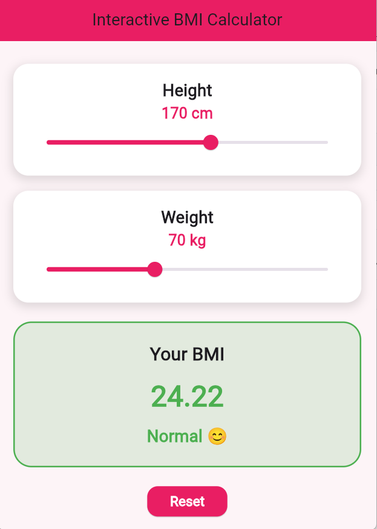
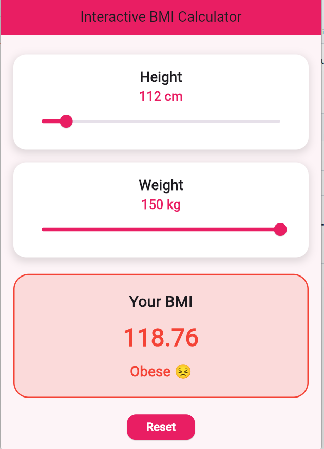
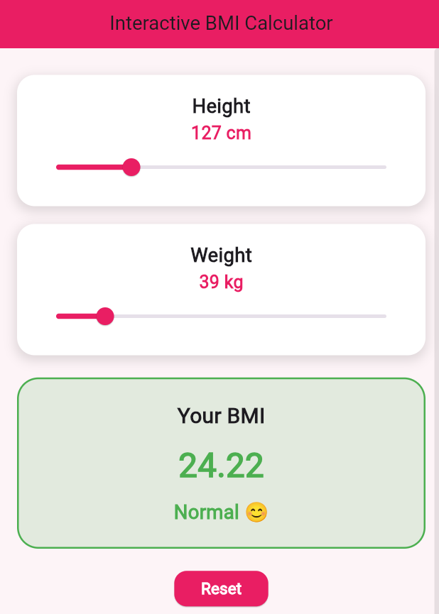

# Assignment 5 - Interactive BMI Calculator

This Flutter project is an interactive BMI calculator that updates the BMI result in real time based on height and weight selected using sliders.

## Logic Used
BMI is calculated using the formula:

BMI = weight / ((height / 100) * (height / 100))

Where:
- weight is in kilograms
- height is in centimeters

## Features
- Height slider
- Weight slider
- Real-time BMI calculation
- BMI category display
- Dynamic color change based on BMI category
- Reset button

## Flutter Widgets Used
- Slider
- Text
- Container
- Column
- ElevatedButton
- setState()

## Screenshots

